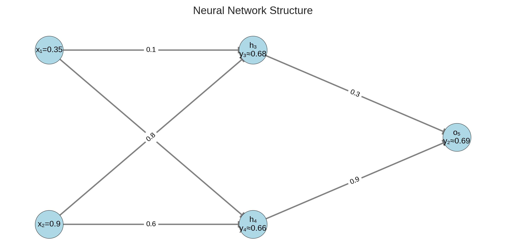
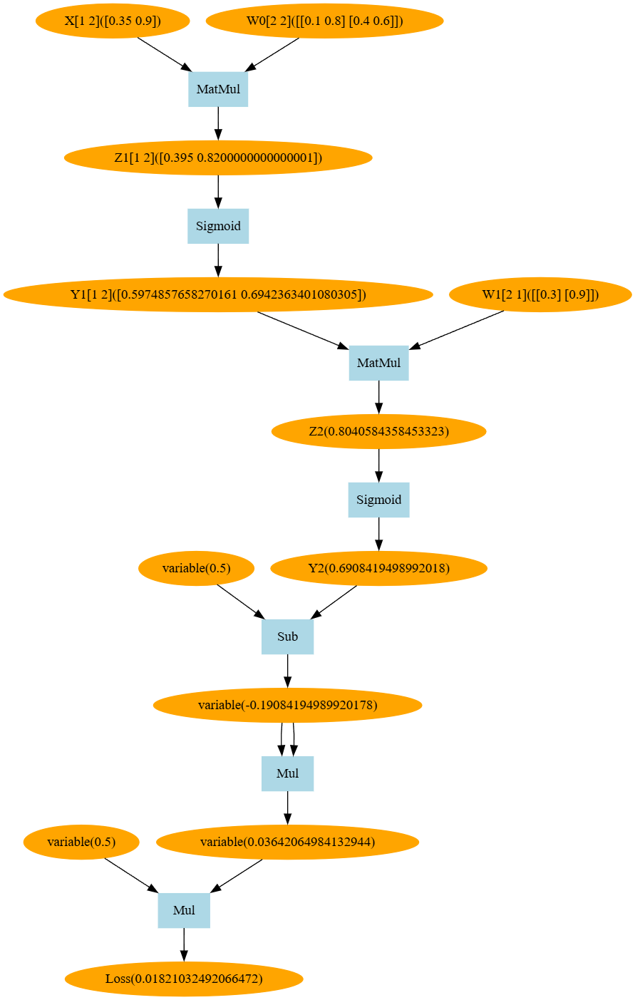

# Backpropagation in a Three-Layer Neural Network

A concise guide to understanding backpropagation (BP) in a three-layer fully connected neural network (input, hidden, output) with Sigmoid activation and no bias terms.

## Network Structure



- **Input Layer (Layer 0)**: 2 neurons, input \( X = \begin{bmatrix} 0.35 & 0.9 \end{bmatrix} \) (row vector).
- **Hidden Layer (Layer 1)**: 2 neurons.
- **Output Layer (Layer 2)**: 1 neuron, target output \( \text{target} = 0.5 \).
- **Weights**:
  - Input to Hidden: \( W_0 = \begin{bmatrix} 0.1 & 0.8 \\ 0.4 & 0.6 \end{bmatrix} \).
  - Hidden to Output: \( W_1 = \begin{bmatrix} 0.3 \\ 0.9 \end{bmatrix} \) (column vector).
- **Activation Function**: Sigmoid, \( f(x) = \frac{1}{1 + e^{-x}} \), derivative \( f'(x) = f(x)(1 - f(x)) \).
- **Loss Function**: Mean squared error, \( \text{Loss} = \frac{1}{2} (\text{target} - y_2)^2 \).

## Forward Propagation

1. **Input to Hidden**:
   $$
   Z_1 = X \cdot W_0 = \begin{bmatrix} 0.35 & 0.9 \end{bmatrix} \cdot \begin{bmatrix} 0.1 & 0.8 \\ 0.4 & 0.6 \end{bmatrix} = \begin{bmatrix} 0.395 & 0.82 \end{bmatrix}
   $$

   $$
   Y_1 = f(Z_1) = \begin{bmatrix} f(0.395) & f(0.82) \end{bmatrix} \approx \begin{bmatrix} 0.5975 & 0.6942 \end{bmatrix}
   $$

2. **Hidden to Output**:
   $$
   Z_2 = Y_1 \cdot W_1 = \begin{bmatrix} 0.5975 & 0.6942 \end{bmatrix} \cdot \begin{bmatrix} 0.3 \\ 0.9 \end{bmatrix} \approx 0.8041
   $$

   $$
   Y_2 = f(0.8041) \approx 0.6908
   $$

3. **Loss**:
   $$
   \text{Loss} = \frac{1}{2} (0.5 - 0.6908)^2 = \frac{1}{2} (-0.1908)^2 = 0.01821
   $$

## Backpropagation

Compute gradients to update weights using the chain rule. Learning rate \( lr = 0.1 \).

### Gradients for \( W_1 \) (Hidden to Output)

The gradient computation follows: \( \frac{\partial \text{Loss}}{\partial W_1} = \frac{\partial \text{Loss}}{\partial Y_2} \cdot \frac{\partial Y_2}{\partial Z_2} \cdot \frac{\partial Z_2}{\partial W_1} \)

- \( \frac{\partial \text{Loss}}{\partial Y_2} = -(0.5 - 0.6908) = 0.1908 \)
- \( \frac{\partial Y_2}{\partial Z_2} = f'(Z_2) = 0.6908 \cdot (1 - 0.6908) = 0.2135 \)
- \( \frac{\partial Z_2}{\partial W_1} = Y_1^T = \begin{bmatrix} 0.5975 \\ 0.6942 \end{bmatrix} \)

Therefore:
$$
\frac{\partial \text{Loss}}{\partial W_1} = 0.1908 \cdot 0.2135 \cdot \begin{bmatrix} 0.5975 \\ 0.6942 \end{bmatrix} \approx \begin{bmatrix} 0.02435 \\ 0.02830 \end{bmatrix}
$$

**Actual computed gradients**: \( \begin{bmatrix} 0.02435 \\ 0.02830 \end{bmatrix} \)

### Gradients for \( W_0 \) (Input to Hidden)

The gradient computation follows: \( \frac{\partial \text{Loss}}{\partial W_0} = X^T \cdot \delta_1 \)

Where \( \delta_1 = \delta_2 \cdot W_1^T \cdot f'(Z_1) \)

- \( \delta_2 = 0.1908 \cdot 0.2135 = 0.04074 \)
- \( f'(Z_1) = \begin{bmatrix} 0.5975 \cdot (1-0.5975) & 0.6942 \cdot (1-0.6942) \end{bmatrix} = \begin{bmatrix} 0.2405 & 0.2123 \end{bmatrix} \)
- \( \delta_1 = 0.04074 \cdot \begin{bmatrix} 0.3 & 0.9 \end{bmatrix} \cdot \begin{bmatrix} 0.2405 & 0 \\ 0 & 0.2123 \end{bmatrix} \)

Therefore:
$$
\frac{\partial \text{Loss}}{\partial W_0} = \begin{bmatrix} 0.35 \\ 0.9 \end{bmatrix} \cdot \delta_1 \approx \begin{bmatrix} 0.001029 & 0.002725 \\ 0.002647 & 0.007008 \end{bmatrix}
$$

**Actual computed gradients**: \( \begin{bmatrix} 0.001029 & 0.002725 \\ 0.002647 & 0.007008 \end{bmatrix} \)

## Weight Updates

- Update \( W_1 \):
  $$
  W_1 = \begin{bmatrix} 0.3 \\ 0.9 \end{bmatrix} - 0.1 \cdot \begin{bmatrix} 0.02435 \\ 0.02830 \end{bmatrix} \approx \begin{bmatrix} 0.29765 \\ 0.89717 \end{bmatrix}
  $$

- Update \( W_0 \):
  $$
  W_0 = \begin{bmatrix} 0.1 & 0.8 \\ 0.4 & 0.6 \end{bmatrix} - 0.1 \cdot \begin{bmatrix} 0.001029 & 0.002725 \\ 0.002647 & 0.007008 \end{bmatrix} \approx \begin{bmatrix} 0.09990 & 0.79973 \\ 0.39974 & 0.59299 \end{bmatrix}
  $$

**Actual computed updates**:

- \( W_1 = \begin{bmatrix} 0.29756 \\ 0.89717 \end{bmatrix} \)
- \( W_0 = \begin{bmatrix} 0.09990 & 0.79973 \\ 0.39974 & 0.59930 \end{bmatrix} \)

## Computational Graph

The Spark automatic differentiation framework builds a computational graph during forward propagation, which is then used for efficient backpropagation:



The graph shows:

- **Orange nodes**: Variables and computed values
- **Blue boxes**: Operations (MatMul, Sigmoid, Sub, Mul)
- **Arrows**: Data flow and dependencies
- **Root node**: Loss function at the top

This computational graph enables automatic gradient computation through reverse-mode differentiation.

## Validation Results

After weight updates:

- **New Output**: \( Y_2 = 0.690077 \)
- **New Loss**: \( 0.018065 \)
- **Loss Reduction**: \( 0.018210 - 0.018065 = 0.000145 \)

## Code Implementation

The implementation uses the Spark automatic differentiation framework:

```go
// Input data (row vector)
x := ag.NewOf([]float64{0.35, 0.9})

// Weight matrices
w0 := ag.NewOf(
    []float64{0.1, 0.8},
    []float64{0.4, 0.6},
)
w1 := ag.NewOf(
    []float64{0.3},
    []float64{0.9},
)

// Forward pass
z1 := ag.MatMul(x, w0)    // X * W0
y1 := nn.Sigmoid(z1)      // Sigmoid(Z1)
z2 := ag.MatMul(y1, w1)   // Y1 * W1
y2 := nn.Sigmoid(z2)      // Sigmoid(Z2)

// Loss calculation
diff := ag.SubC(target, y2)  // target - y2
loss := ag.Mul(ag.New(0.5), ag.Mul(diff, diff))  // 0.5 * diff²
```

## Key Notes

- **Matrix Dimensions**: Input X is 1×2, W0 is 2×2, W1 is 2×1, ensuring proper matrix multiplication.
- **Loss Formula**: Uses \( \frac{1}{2}(\text{target} - y_2)^2 \) as implemented in code.
- **Sigmoid Derivative**: \( f'(x) = f(x)(1 - f(x)) \), critical for gradient computation.
- **Chain Rule**: Gradients propagate backward, multiplying derivatives at each layer.
- **Automatic Differentiation**: The Spark framework handles gradient computation automatically via the computational graph.
